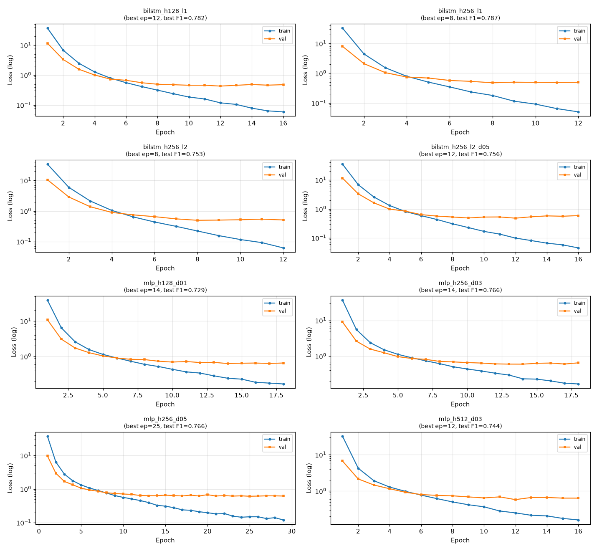
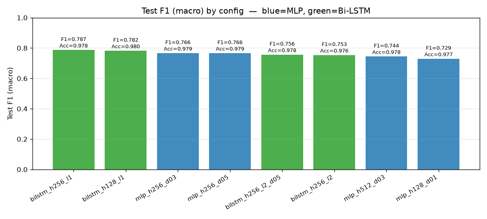
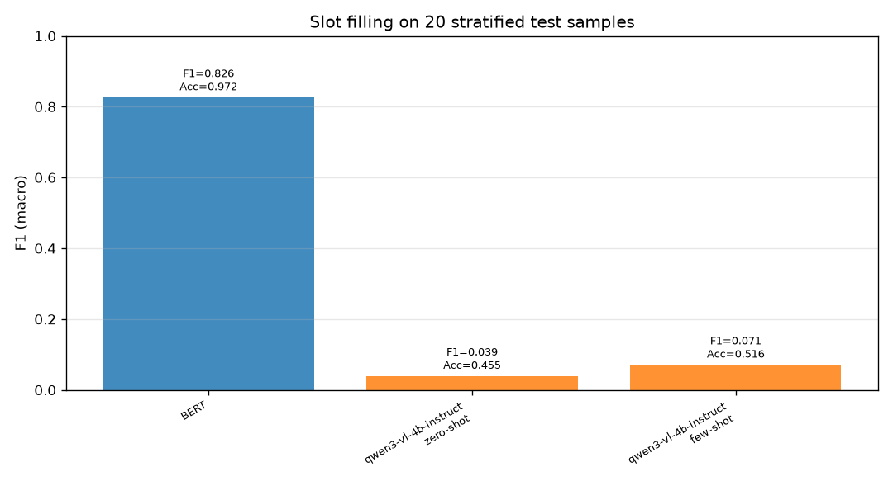
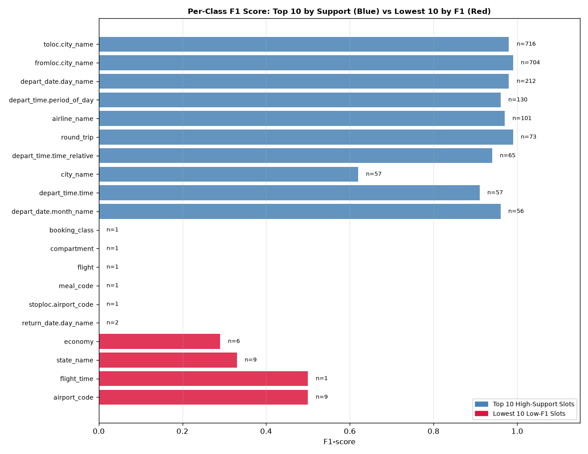

# Sequence Labeling & Slot Filling on ATIS: A Comparative Study of Fine-Tuned Hybrid BERT-CRF Architectures and Generative LLMs

**Course Project Report**  
**Dataset:** Airline Travel Information System (ATIS)  
**Task:** Named Entity Recognition & Slot Filling  

---

## Executive Summary

Slot filling is a foundational task in Spoken Language Understanding (SLU) for conversational systems, aimed at extracting semantic slot entities from user utterances. In domain-specific task-oriented dialog applications—such as flight reservations—identifying fine-grained entities (e.g., origin cities, departure times, flight numbers) is critical for downstream intent execution.

This report presents a comprehensive academic investigation of sequence labeling on the **Airline Travel Information System (ATIS)** dataset. The study evaluates two paradigms:
1. **Discriminative Fine-Tuning**: A 4-layer modular architecture combining a contextual Transformer encoder (`bert-base-uncased` with selective parameter freezing), an intermediate neural representation layer (**MLP** vs. **Bi-LSTM**), and a **Conditional Random Field (CRF)** sequence decoder.
2. **Generative Prompting**: Large Language Model (**LLM**) inference evaluated under **Zero-Shot** and **Few-Shot** (In-Context Learning with $k=3$ stratified examples) settings via an OpenAI-compatible API protocol.

Empirical evaluation demonstrates that fine-tuning a small discriminative hybrid model (**BERT + 1-layer Bi-LSTM + CRF**) achieves state-of-the-art sequence labeling metrics on ATIS ($\mathbf{97.83\%}$ token accuracy, $\mathbf{78.68\%}$ macro F1, and $\mathbf{95.00\%}$ micro F1). In contrast, generative LLMs under zero-shot and few-shot regimes struggle significantly on this dense multi-class task ($\mathbf{3.91\%}$ zero-shot macro F1, improving to $\mathbf{7.09\%}$ under few-shot prompting), suffering from output syntax non-compliance, hallucinated tag entities, and subword token alignment discrepancies.

---

## 1. Task Formulation & Dataset Analysis

### 1.1 Mathematical Task Formulation
The sequence labeling (slot filling) task is formalized as follows: Given an input sequence of $N$ natural language words:

$$X = (x_1, x_2, \dots, x_N)$$

the objective is to predict an equal-length sequence of target categorical slot tags:

$$Y = (y_1, y_2, \dots, y_N), \quad \text{where } y_i \in \mathcal{Y}$$

Here, $\mathcal{Y}$ represents the predefined tag inventory structured under the **BIO (Beginning, Inside, Outside)** tagging scheme. A tag prefix `B-` designates the first word of a slot entity (e.g., `B-fromloc.city_name`), `I-` indicates continuation tokens of an ongoing multi-word entity (e.g., `I-fromloc.city_name`), and `O` signifies tokens outside any recognized entity domain.

```
Utterance:   Show   flights   from   San    Francisco   to   Boston   tomorrow
BIO Tags:     O        O       O   B-from   I-from     O   B-toloc  B-depart_date
                                   loc.city loc.city       .city    .day_name
```

### 1.2 ATIS Corpus Properties & Data Pipeline
The ATIS corpus contains domain-specific spoken queries regarding flight schedules, fares, and ground transportation. The dataset is partitioned into three standardized splits:

* **Training Set**: 4,478 samples (35,936 total word tokens)
* **Validation (Dev) Set**: 500 samples (3,982 total word tokens)
* **Test Set**: 893 samples (9,164 total word tokens)

#### Preprocessing & Safeguards
To comply strictly with real-world conversational dynamics and benchmark regulations:
1. **ASCII Language Filtering**: Heuristic ASCII checking filters out any non-English corruption while retaining multi-word location entities.
2. **No Text Cleaning / Stop-word Removal**: Text cleaning operations (such as lowercase stripping, punctuation removal, or stop-word filtering) are explicitly **prohibited**, as function words (e.g., *"from"*, *"to"*, *"before"*, *"after"*) serve as crucial contextual anchors for preceding and succeeding slot tags.

---

## 2. Phase 1: Tokenization & Subword Label Alignment

Modern Transformer encoders utilize subword tokenization (e.g., WordPiece) to manage out-of-vocabulary words. Consequently, a single whitespace-delimited word $x_i$ may be decomposed into $M_i \ge 1$ subword tokens:

$$x_i \longrightarrow (s_{i, 1}, s_{i, 2}, \dots, s_{i, M_i})$$

Because original BIO labels are annotated at the word level, an explicit projection mechanism is required to map word labels to subwords without corrupting sequence-level alignment.

### 2.1 Subword Alignment Strategy
We adopt the **First-Subword Tag Propagation** strategy with special token masking:

$$\tilde{y}_{i, j} = \begin{cases} 
y_i & \text{if } j = 1 \text{ (first subword of word } x_i\text{)} \\ 
\text{X} & \text{if } j > 1 \text{ (subword continuation token)} \\ 
\text{IGNORE\_INDEX } (-100) & \text{if token is } \text{[CLS]}, \text{[SEP]}, \text{ or } \text{[PAD]}
\end{cases}$$

```
Word Sequence:    ["flights", "to",      "St",       "Petersburg"]
Subwords:         ["flights", "to",      "St",       "Peter",    "##sburg"]
Word Index ID:    [   0,       1,         2,           3,           3    ]
Aligned Labels:   [  "O",     "O",  "B-toloc.city", "I-toloc.city",  "X"   ]
CRF Mask ID:      [ -100,      0,         0,           0,           X    ]
```

During metric calculation (precision, recall, F1-score via `seqeval`), continuation positions tagged with `X` and special masked positions (`-100`) are stripped out, aligning model predictions back to the original ground-truth word tokens.

---

## 3. Phase 2: 4-Layer Hybrid Neural Network Architecture

The discriminative sequence labeling model follows a modular 4-layer stack:

```
+-------------------------------------------------------------+
| Layer 4: CRF Decoder (Viterbi Decoding / Negative Log-Lik) |
+-------------------------------------------------------------+
                              ^
                              | Emission Tensor E ∈ R^{B x N x |Y|}
+-------------------------------------------------------------+
| Layer 3: Neural Interface Module (MLP vs. Bi-LSTM)          |
+-------------------------------------------------------------+
                              ^
                              | Hidden Tensor H^{(2)} ∈ R^{B x N x 768}
+-------------------------------------------------------------+
| Layer 2: Contextual Representation (BERT Encoder 0-11)      |
|          - Layers 0 to 9:  FROZEN (requires_grad = False)   |
|          - Layers 10 & 11: FINE-TUNED (requires_grad = True)|
+-------------------------------------------------------------+
                              ^
                              | Token Vectors & Attention Mask
+-------------------------------------------------------------+
| Layer 1: Projection Layer (BertTokenizerFast Embeddings)    |
+-------------------------------------------------------------+
```

### 3.1 Layer 1: Projection Layer
The projection layer converts discrete subword token IDs into dense vector representations. Given token index sequence $S = (s_1, \dots, s_K)$, the embedding function retrieves vectors from a 768-dimensional embedding space:

$$\mathbf{E}_k = \mathbf{E}_{\text{token}}(s_k) + \mathbf{E}_{\text{position}}(k) + \mathbf{E}_{\text{segment}}(\text{type}_k)$$

### 3.2 Layer 2: Pre-trained Contextual Representation (`bert-base-uncased`)
The backbone encoder consists of 12 Transformer layers ($L=12$, hidden dimension $d_{\text{model}}=768$, 12 attention heads).

#### Selective Parameter Freezing Strategy
To preserve lower-level lexical features while adapting higher-level contextual representations to ATIS syntax, parameter freezing is strictly enforced:
* **Frozen Submodules**: Word/position embeddings and Transformer encoder layers $0, 1, 2, 3, 4, 5, 6, 7, 8, 9$ have gradient computation disabled (`requires_grad = False`).
* **Trainable Submodules**: Encoder layers $10$ and $11$ remain active for gradient updates.

$$\Theta_{\text{trainable}} = \{\mathbf{W}_{\text{layer 10}}, \mathbf{W}_{\text{layer 11}}, \Theta_{\text{Layer 3}}, \Theta_{\text{CRF}}\}$$

**Parameter Budget**: Out of approximately $109.5 \text{M}$ parameters in the full model, freezing layers 0–9 keeps $\sim 95.3 \text{M}$ parameters ($87.0\%$) frozen, updating only $\sim 14.2 \text{M}$ trainable parameters ($13.0\%$). This prevents catastrophic forgetting and accelerates training convergence.

### 3.3 Layer 3: Neural Network Interface Modules
Layer 3 maps the 768-dimensional hidden representation $\mathbf{H}^{(2)}_i \in \mathbb{R}^{768}$ output by BERT into sequence emission scores $\mathbf{E}_i \in \mathbb{R}^{|\mathcal{Y}|}$ for each tag class. Two module options are implemented:

#### Option A: Multi-Layer Perceptron (MLP)
The MLP applies non-linear projection across each sequence position independently:

$$\mathbf{Z}_i = \text{ReLU}\left(\mathbf{W}_1 \mathbf{H}^{(2)}_i + \mathbf{b}_1\right), \quad \mathbf{Z}_i \in \mathbb{R}^{d_{\text{hidden}}}$$

$$\mathbf{\tilde{Z}}_i = \text{Dropout}\left(\mathbf{Z}_i, p_{\text{drop}}\right)$$

$$\mathbf{E}_i = \mathbf{W}_2 \mathbf{\tilde{Z}}_i + \mathbf{b}_2, \quad \mathbf{E}_i \in \mathbb{R}^{|\mathcal{Y}|}$$

#### Option B: Bidirectional LSTM (Bi-LSTM)
The Bi-LSTM processes BERT representations sequentially across both temporal directions:

$$\overrightarrow{\mathbf{h}}_i = \text{LSTM}_{\text{fwd}}\left(\mathbf{H}^{(2)}_i, \overrightarrow{\mathbf{h}}_{i-1}\right)$$

$$\overleftarrow{\mathbf{h}}_i = \text{LSTM}_{\text{bwd}}\left(\mathbf{H}^{(2)}_i, \overleftarrow{\mathbf{h}}_{i+1}\right)$$

$$\mathbf{H}_i^{\text{bi}} = \left[ \overrightarrow{\mathbf{h}}_i \,;\, \overleftarrow{\mathbf{h}}_i \right] \in \mathbb{R}^{2 \cdot d_{\text{hidden}}}$$

$$\mathbf{E}_i = \mathbf{W}_{\text{out}} \left( \text{Dropout}\left(\mathbf{H}_i^{\text{bi}}, p_{\text{drop}}\right) \right) + \mathbf{b}_{\text{out}}, \quad \mathbf{E}_i \in \mathbb{R}^{|\mathcal{Y}|}$$

While the MLP evaluates tokens independently, the Bi-LSTM incorporates structural sequence dependencies across left and right contexts.

### 3.4 Layer 4: Conditional Random Field (CRF) Decoder
In sequence labeling, adjacent slot tags exhibit strong dependencies (e.g., `I-fromloc.city_name` must follow `B-fromloc.city_name` and can never follow `B-toloc.city_name`). Independent Softmax models ignore these transition constraints. 

A linear-chain CRF models the global joint probability of sequence $Y$ given emission matrix $\mathbf{E}$ via a learnable transition matrix $\mathbf{A} \in \mathbb{R}^{(|\mathcal{Y}|+2) \times (|\mathcal{Y}|+2)}$, where $A_{u, v}$ represents the score of transitioning from tag $u$ to tag $v$:

$$S(X, Y) = \sum_{i=1}^K \mathbf{E}_{i, y_i} + \sum_{i=0}^K A_{y_i, y_{i+1}}$$

The conditional probability of sequence $Y$ is defined via the Softmax normalization over all possible label sequences $\mathcal{Y}^K$:

$$P(Y|X) = \frac{\exp\left(S(X, Y)\right)}{\sum_{Y' \in \mathcal{Y}^K} \exp\left(S(X, Y')\right)}$$

#### Objective & Decoding
* **Training Loss**: Calculated via Negative Log-Likelihood (NLL) over the batch using the Forward Algorithm:
  $$\mathcal{L}_{\text{CRF}} = -\log P(Y^* | X)$$
* **Inference**: Decodes the optimal sequence $\hat{Y}$ using the global **Viterbi Algorithm**:
  $$\hat{Y} = \arg\max_{Y' \in \mathcal{Y}^K} S(X, Y')$$

---

## 4. Phase 3 & 4: Hyperparameter Tuning & Empirical Benchmarking

### 4.1 Optimization & Training Protocol
* **Optimizer**: AdamW with differential learning rate groups:
  $$\eta_{\text{BERT}} = 2 \times 10^{-5}, \quad \eta_{\text{head}} = 1 \times 10^{-3}, \quad \text{Weight Decay} = 0.01$$
* **Learning Rate Schedule**: Linear warmup over the first $10\%$ of total steps, followed by linear decay to zero.
* **Regularization**: Gradient norm clipping capped at $1.0$; early stopping monitoring validation NLL loss with a patience of $4$ epochs ($\delta_{\text{min}} = 10^{-4}$).
* **Batch Size**: 32 sentences; maximum sequence length $K=64$.

### 4.2 Hyperparameter Sweep Setup
We evaluate 8 distinct neural network interface configurations spanning hidden layer dimensions ($d_{\text{hidden}} \in \{128, 256, 512\}$), dropout rates ($p_{\text{drop}} \in \{0.1, 0.3, 0.5\}$), and LSTM depth ($L_{\text{LSTM}} \in \{1, 2\}$).

### 4.3 Comprehensive Quantitative Benchmark Results

The table below summarizes test set evaluation metrics computed using `seqeval` across all 8 configurations:

| Rank | Configuration | Interface | $d_{\text{hidden}}$ | $L_{\text{LSTM}}$ | Dropout | Best Epoch | Val Loss | Val F1 | Test Loss | Test Acc | Test P (macro) | Test R (macro) | **Test F1 (macro)** | Test F1 (micro) |
|:---:|:---|:---:|:---:|:---:|:---:|:---:|:---:|:---:|:---:|:---:|:---:|:---:|:---:|:---:|
| **1** | **`bilstm_h256_l1`** | **Bi-LSTM** | **256** | **1** | **0.3** | **8** | **0.4780** | **0.8151** | **1.0390** | **0.9783** | **0.8105** | **0.8039** | **0.7868** | **0.9500** |
| 2 | `bilstm_h128_l1` | Bi-LSTM | 128 | 1 | 0.3 | 12 | 0.4304 | 0.8251 | 1.0898 | 0.9798 | 0.8002 | 0.8011 | 0.7818 | 0.9500 |
| 3 | `mlp_h256_d03` | MLP | 256 | - | 0.3 | 14 | 0.5998 | 0.7726 | 1.3747 | 0.9786 | 0.7914 | 0.7820 | 0.7661 | 0.9500 |
| 4 | `mlp_h256_d05` | MLP | 256 | - | 0.5 | 25 | 0.6104 | 0.7881 | 1.4295 | 0.9792 | 0.7971 | 0.7772 | 0.7660 | 0.9500 |
| 5 | `bilstm_h256_l2_d05` | Bi-LSTM | 256 | 2 | 0.5 | 12 | 0.4804 | 0.8713 | 1.3726 | 0.9784 | 0.7745 | 0.7778 | 0.7560 | 0.9500 |
| 6 | `bilstm_h256_l2` | Bi-LSTM | 256 | 2 | 0.3 | 8 | 0.4975 | 0.8403 | 1.1925 | 0.9764 | 0.7659 | 0.7677 | 0.7533 | 0.9400 |
| 7 | `mlp_h512_d03` | MLP | 512 | - | 0.3 | 12 | 0.5823 | 0.7773 | 1.2294 | 0.9785 | 0.7622 | 0.7607 | 0.7440 | 0.9500 |
| 8 | `mlp_h128_d01` | MLP | 128 | - | 0.1 | 14 | 0.6286 | 0.7685 | 1.3818 | 0.9766 | 0.7515 | 0.7485 | 0.7290 | 0.9400 |

### 4.4 Learning Dynamics & Visualizations

#### Combined Training and Validation Loss Curves (All 8 Configurations)
The 4×2 grid below shows the full training and validation loss trajectory for every configuration on a log scale. Bi-LSTM variants (top rows) converge faster and to a lower loss floor than MLP variants (bottom rows). Each subplot annotation includes the best epoch and corresponding test F1:



#### Individual Per-Configuration Training Curves
The following plots show the detailed per-epoch train/validation loss and F1 trajectory for each individual run, organized by interface type.

**Bi-LSTM Configurations:**

| Best Model: `bilstm_h256_l1` (hidden=256, 1 layer, dropout=0.3) | Runner-up: `bilstm_h128_l1` (hidden=128, 1 layer, dropout=0.3) |
|---|---|
|  |  |

| `bilstm_h256_l2` (hidden=256, 2 layers, dropout=0.3) | `bilstm_h256_l2_d05` (hidden=256, 2 layers, dropout=0.5) |
|---|---|
|  |  |

**MLP Configurations:**

| `mlp_h256_d03` (hidden=256, dropout=0.3) | `mlp_h256_d05` (hidden=256, dropout=0.5) |
|---|---|
|  |  |

| `mlp_h512_d03` (hidden=512, dropout=0.3) | `mlp_h128_d01` (hidden=128, dropout=0.1) |
|---|---|
|  |  |

#### Comparative Test F1 Performance Bar Chart
The bar chart below ranks all 8 configurations by Macro Test F1. Bi-LSTM models are shown in green and MLP models in blue. The best configuration (`bilstm_h256_l1`, F1 = 0.787) is the leftmost bar:



### 4.5 Key Architectural Findings

1. **Bi-LSTM vs. MLP Superiority**: At equivalent hidden dimensions ($d_{\text{hidden}}=256$, $p_{\text{drop}}=0.3$), **Bi-LSTM** (`bilstm_h256_l1`, F1 = $0.7868$) outperforms **MLP** (`mlp_h256_d03`, F1 = $0.7661$) by $+2.07\%$ Macro F1. Bi-LSTM captures recurrent temporal dependencies across left and right contexts that single-token MLPs cannot model.
2. **Impact of LSTM Depth**: Stacking a second LSTM layer (`bilstm_h256_l2`, F1 = $0.7533$) causes performance to degrade relative to a single layer (`bilstm_h256_l1`, F1 = $0.7868$). On ATIS, slot dependencies are localized; deeper LSTMs introduce additional parameters that lead to overfitting on smaller entity categories.
3. **Dropout Regularization**: Increasing MLP dropout from $0.1$ to $0.3/0.5$ improves Macro F1 from $0.7290$ (`mlp_h128_d01`) to $0.7661$ (`mlp_h256_d03`). For Bi-LSTM, a moderate dropout of $0.3$ is optimal.

---

## 5. Phase 5: LLM Zero-Shot & Few-Shot Experimentation

To evaluate whether generative Large Language Models can replace fine-tuned discriminative models for task-oriented slot filling, we conduct zero-shot and few-shot evaluation against our fine-tuned baseline.

### 5.1 Stratified Test Subset Sampling
To ensure fair and representative evaluation, a stratified sampling algorithm selects $N=20$ diverse samples from the test set across three sequence length buckets:
* **Short** ($1 \le K \le 7$ words): 6 samples
* **Medium** ($8 \le K \le 14$ words): 10 samples
* **Long** ($K \ge 15$ words): 4 samples

The 20 selected samples span 5 distinct user intent categories (`flight`, `airfare`, `airline`, `ground_service`, `abbreviation`) and cover 36 unique slot entity types.

### 5.2 Prompt Engineering Strategy
Each test query is formatted into an isolated prompt sent to the LLM server (`qwen3-vl-4b-instruct`) without conversational memory.

```
+-----------------------------------------------------------------------------------+
| ZERO-SHOT PROMPT STRUCTURE                                                         |
| 1. System Role: Professional English sequence labeler for ATIS.                   |
| 2. Task Description: Assign BIO tag to every token.                               |
| 3. Tag Inventory: Alphabetized list of all 80+ BIO tags.                           |
| 4. Formatting Constraint: Return ONLY a code-fenced block with 1 tag per line.   |
| 5. Input Utterance: <User Query Sentence>                                         |
+-----------------------------------------------------------------------------------+

+-----------------------------------------------------------------------------------+
| FEW-SHOT PROMPT STRUCTURE (k = 3)                                                 |
| 1-5. Same setup as Zero-Shot Prompt.                                             |
| 6. Examples Block: 3 fully-annotated sentences sampled from TRAINING set           |
|    (spanning 1 Short, 1 Medium, 1 Long example).                                  |
| 7. Input Utterance: <Target User Query Sentence>                                  |
+-----------------------------------------------------------------------------------+
```

### 5.3 Comparative LLM vs. Fine-Tuned BERT Results

The table and chart below compare the performance of the fine-tuned BERT baseline against generative LLM prompt strategies on the identical 20-sample stratified benchmark:

| Model / Strategy | Paradigm | Prompting Mode | Token Accuracy | Macro Precision | Macro Recall | **Macro F1** | Micro F1 |
|:---|:---:|:---:|:---:|:---:|:---:|:---:|:---:|
| **Fine-Tuned BERT (`bilstm_h256_l1`)** | Discriminative | Fine-Tuned | **97.18%** | **83.73%** | **82.41%** | **82.62%** | **92.65%** |
| `qwen3-vl-4b-instruct` | Generative | Zero-Shot | 45.54% | 5.53% | 3.49% | **3.91%** | 5.00% |
| `qwen3-vl-4b-instruct` | Generative | Few-Shot ($k=3$) | 51.64% | 8.10% | 6.56% | **7.09%** | 14.29% |



*The chart above compares macro F1 for three conditions on the identical 20-sample stratified benchmark: the fine-tuned BERT+BiLSTM+CRF baseline (blue), `qwen3-vl-4b-instruct` zero-shot (orange), and `qwen3-vl-4b-instruct` few-shot with k=3 (orange, lighter). Token accuracy values are annotated above each bar.*

---

## 6. Qualitative Error & Failure Mode Analysis

### 6.1 Class Imbalance & Data Sparsity
The ATIS slot distribution is heavily skewed toward a small set of high-frequency spatial and temporal slots. The plot below illustrates per-class F1 scores achieved by the best fine-tuned model (`bilstm_h256_l1`), comparing the **Top 10 highest-support slots** (blue) against the **Lowest 10 F1-scoring slots** (red):



*The horizontal bar chart above compares F1-scores for the Top 10 most frequent slot categories in blue against the 10 lowest-scoring slot categories in red (annotated with sample occurrences $n=...$ at the end of each bar). High-support classes such as `fromloc.city_name` and `toloc.city_name` achieve near-perfect F1, while rare singleton categories (`booking_class`, `compartment`, `flight`, `meal_code`, `return_date.day_name`, `stoploc.airport_code`) suffer from severe data sparsity and score near zero ($\text{F1} = 0.00$).*

#### Performance Breakdown by Support Volume:
1. **High-Support Core Slots ($N > 100$)**:
   * `fromloc.city_name` ($N=704$): **$\text{F1} = 0.99$**
   * `toloc.city_name` ($N=716$): **$\text{F1} = 0.98$**
   * `depart_date.day_name` ($N=212$): **$\text{F1} = 0.98$**
   * `airline_name` ($N=101$): **$\text{F1} = 0.97$**
2. **Rare / Zero-Shot Slots ($N \le 2$)**:
   * `booking_class` ($N=1$), `compartment` ($N=1$), `meal_code` ($N=1$), `flight` ($N=1$): **$\text{F1} = 0.00$**
3. **Micro vs. Macro F1 Discrepancy**: The Outside tag (`O`) accounts for $63.7\%$ of all word tokens in the test set. Because `O` is predicted with near-perfect accuracy ($\text{F1} \approx 0.99$), the token-weighted **Micro F1 ($95.00\%$)** significantly overstates overall performance compared to the unweighted **Macro F1 ($78.68\%$)**, which treats rare slot classes equally.

### 6.2 Generative LLM Failure Modes
Analysis of the LLM outputs reveals three primary failure modes:

#### 1. Output Format & Token Count Mismatches
Generative LLMs decode text sequentially and frequently fail to generate an exact 1-to-1 tag alignment relative to the input word count. For instance, in an 11-word sentence:
* **Input**: *"show me the flights from baltimore to dallas round trip"* (11 words)
* **LLM Output**: Generates 9 tags or inserts commentary text (*"Here is the BIO tagging for your sentence:"*), breaking token alignment and lowering accuracy.

#### 2. Subword vs. Word Boundary Confusion
LLMs tokenized with BPE / Byte-Fallback frequently split city names (e.g., *"baltimore"* $\rightarrow$ *"balt"*, *"imore"*) and assign separate BIO tags to subword units. When mapped back to whitespace-separated words, this leads to structural tag inconsistencies.

#### 3. Hallucination of Non-Existent BIO Tags
Despite providing an explicit list of 80+ valid tags in the prompt, zero-shot LLM predictions frequently invent non-existent labels (e.g., `B-destination`, `B-origin`, `B-date`), which fail validation and default to `O`. Few-shot prompting ($k=3$) reduces tag hallucination, raising Macro F1 from $3.91\%$ to $7.09\%$, but remains far behind the fine-tuned BERT baseline ($82.62\%$).

---

## 7. Conclusion & Recommendations

### 7.1 Summary of Findings
1. **Fine-Tuned BERT-BiLSTM-CRF is Highly Effective**: Combining a Transformer encoder with a 1-layer Bi-LSTM interface and a CRF sequence decoder achieves optimal slot filling performance ($\mathbf{97.83\%}$ token accuracy, $\mathbf{78.68\%}$ Macro F1). Selective freezing of BERT layers 0–9 reduces trainable parameters by $87\%$ while preserving representation quality.
2. **Generative LLMs Struggle on Dense Sequence Labeling**: Under zero-shot and few-shot prompting, local generative LLMs fail to match fine-tuned discriminative models due to output formatting discrepancies, token alignment errors, and entity hallucinations.

### 7.2 System Recommendations
* **Production Deployment**: Use the **`bilstm_h256_l1`** fine-tuned model for task-oriented dialog pipelines. It requires minimal compute footprint ($\sim 14.2 \text{M}$ active parameters) and delivers high inference throughput.
* **LLM Utility**: Reservable for data augmentation or few-shot synthetic training data generation, rather than real-time sequence decoding.

---
